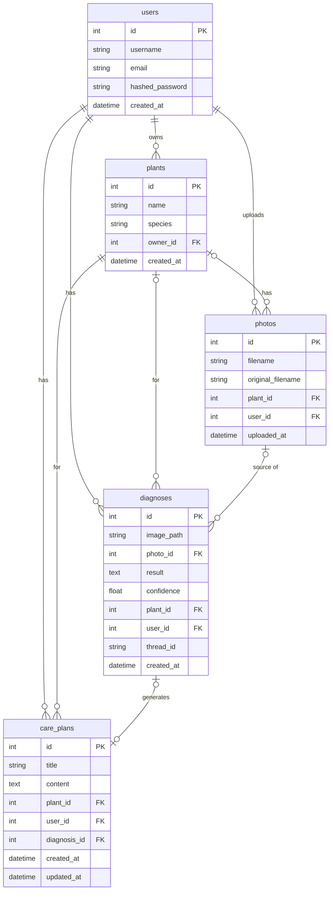

# Plant Doctor

AI-powered plant diagnosis and care planning app. Upload a photo of your plant, get a diagnosis, answer a few clarifying questions, and receive a personalised step-by-step care plan. Come back seven days later to compare photos and see if your plant is improving.

---

## How it works

1. **Upload a photo** — the agent identifies the species and diagnoses the issue (disease, pest, overwatering, underwatering, nutrient deficiency, or light stress).
2. **Answer clarifying questions** — if the diagnosis is ambiguous the agent asks 2–3 targeted questions before writing the care plan.
3. **Get a care plan** — a numbered, actionable plan written by the agent, citing your knowledge base where relevant.
4. **7-day check-in** — upload a new photo a week later; the agent compares before-and-after and revises the care plan.

---

## Project structure

```
plant-doctor/
├── backend/            # FastAPI REST API + SQLite database
│   ├── main.py         # app entry point, runs Alembic migrations on startup
│   ├── models.py       # SQLAlchemy ORM models
│   ├── database.py     # DB engine and session factory
│   ├── auth.py         # JWT authentication helpers
│   ├── schemas.py      # Pydantic request/response schemas
│   ├── routers/        # route handlers (auth, plants, diagnose, knowledge)
│   ├── rag_service.py  # ChromaDB vector store for the knowledge base
│   ├── vision_service.py  # GPT-4o vision calls (species ID + diagnosis)
│   └── alembic/        # database migrations
├── agent/
│   ├── graph.py        # LangGraph state machine (identify → diagnose → care plan)
│   └── checkpointer.py # SQLite checkpoint store for LangGraph threads
├── frontend/
│   └── app.py          # Streamlit single-page app
├── requirements.txt
└── .env                # environment variables (never commit this file)
```

---

## Database

The app uses **two SQLite databases** and one **vector store**.

### `backend/plant_doctor.db` — application data

Managed by SQLAlchemy + Alembic. The schema is applied automatically every time the backend starts.

| Table | Purpose |
|---|---|
| `users` | Registered accounts (username, email, hashed password) |
| `plants` | Each user's plants (name, species, owner FK) |
| `photos` | Uploaded image metadata linked to a user and optionally a plant |
| `diagnoses` | One row per diagnosis — stores issue category, confidence, image path, and the LangGraph `thread_id` |
| `care_plans` | Generated care plan text linked to a diagnosis and plant |

The `thread_id` column on `diagnoses` is the key that links a diagnosis record to its LangGraph checkpoint, which is what makes the 7-day check-in possible.



### `checkpoints.db` — LangGraph agent state

A separate SQLite file at the project root. LangGraph writes a checkpoint after every node so that:

- a paused graph (waiting for the user's answers) can be resumed later via `thread_id`
- the check-in flow can reload the original diagnosis state without re-running the full agent

### `knowledge_db/` — ChromaDB vector store

Text pasted into the Knowledge Base page is split into overlapping chunks, embedded with `text-embedding-3-small`, and stored here. The care-plan node retrieves the top-4 most relevant chunks at generation time and cites them in the output.

---

## Setup

### Prerequisites

- Python 3.11+
- An OpenAI API key (`gpt-4o` and `text-embedding-3-small`)

### Install

```bash
python -m venv venv

# Windows
venv\Scripts\activate
# macOS/Linux
source venv/bin/activate

pip install -r requirements.txt
```

### Environment variables

Create a `.env` file in the project root (already listed in `.gitignore`):

```
DATABASE_URL=sqlite:///./plant_doctor.db
SECRET_KEY=<generate a long random string>
UPLOAD_DIR=uploads
API_BASE=http://localhost:8000
OPENAI_API_KEY=<your key>
```

### Run

Open two terminals from the project root.

**Terminal 1 — backend:**
```bash
cd backend
uvicorn main:app --reload
```

**Terminal 2 — frontend:**
```bash
cd frontend
streamlit run app.py
```

Open `http://localhost:8501` in your browser.

---

## API docs

Interactive Swagger UI is available at `http://localhost:8000/docs` once the backend is running.

---

## Tech stack

| Layer | Technology |
|---|---|
| Frontend | Streamlit |
| Backend | FastAPI |
| Agent | LangGraph |
| Vision / LLM | OpenAI GPT-4o, GPT-4o-mini |
| Embeddings | OpenAI text-embedding-3-small |
| App database | SQLite via SQLAlchemy + Alembic |
| Agent state | SQLite via LangGraph checkpointer |
| Vector store | ChromaDB (local persistent) |
| Auth | JWT (python-jose + passlib/bcrypt) |
